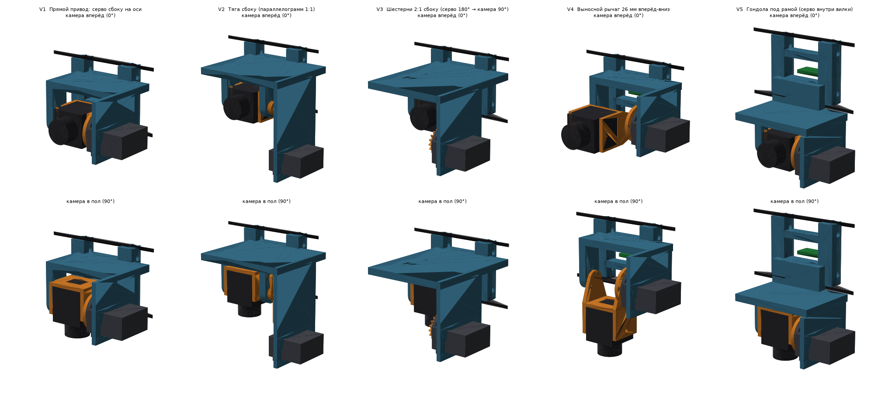
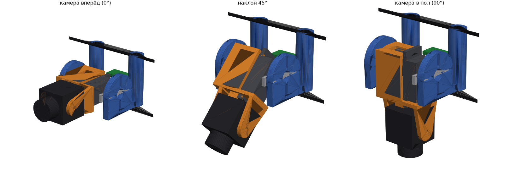

# Наклоняемая камера для «Колибри» (Mark4 10" V2): 5 вариантов

Камера micro 19 × 19 мм сидит в люльке. Серво опускает её от **0° (вперёд)** до **90° (в пол)**.

Весь узел **надевается на 2 передние стойки рамы**: два хомута-защёлки во всю высоту, прорезью назад, при необходимости стягиваются винтами M3. **Позади стоек ничего нет**: там стоит плата ESP. Серво и вся механика расположены **сбоку от камеры**. Камера вынесена вперёд, поэтому в положении «в пол» нижняя плита не попадает в кадр.

| # | Механизм | Плюсы | Минусы |
|---|---|---|---|
| V1 | Прямой привод: вал серво = ось наклона | 2 печатные детали, минимум люфта, проще всего | серво торчит сбоку примерно на 30 мм |
| V2 | Тяга-параллелограмм сбоку, серво ниже оси | сверху узко, ход 1:1 | 3 детали, люфт в 2 шарнирах M2, вниз выступает больше всех |
| V3 | Шестерни 2:1 сбоку (серво 180° → камера 90°) | вдвое точнее и сильнее, держит камеру при вибрации | модуль 0.8, печать слоем 0.12, 3 детали |
| V4 | Выносной рычаг 26 мм вперёд-вниз | в пол смотрит из-под носа, рама вообще не видна | камера уходит на 26 мм, нужен шлейф длиннее, больше рычаг при ударе |
| V5 | Гондола под нижней плитой, серво внутри вилки | камера ниже плиты: ничего не мешает ни вперёд, ни вниз | самый низкий, первым встречает землю при посадке |

Проверено (`python3 cam_tilt.py --check`):
- на всём ходе 0…90° люлька, камера, тяга и шестерни ничего не задевают;
- серво не врезается в крепление;
- крепление не врезается в плиты и стойки;
- позади стоек ничего нет;
- в V3 шестерни не клинят и стоят в зацеплении.

## Что заложено и что нужно замерить

| Параметр | Сейчас | Откуда |
|---|---|---|
| Между центрами передних стоек `SO_S` | 33 мм | **замер** |
| Диаметр стойки `SO_D` | 5 мм, круглая | **замерить** (если стойки шестигранные — тоже сказать) |
| Между плитами `PLATE_GAP` | 35 мм | Mark4 10" V2 (стойки 35 мм) |
| Насколько нижняя плита выступает перед стойками `PLATE_FRONT_X` | 6 мм | **замерить** |
| Камера | micro 19 × 19, винты M2 по бокам в 8 мм от передней грани | Mark4 V2 рассчитан на micro 19 мм. Модель камеры уточнить |
| Серво | 9 г (SG90 / MG90S / ES08), 22.8 × 12.2 × 22.7 | можно поставить меньше (3.7–5 г), скажите модель |

STL: `stl/V1…V5/`. Это эскизы для выбора: после выбора варианта и замеров пересоберу крепление точно под вашу раму и камеру.

---

## Вариант «как на фото» (MG90S поворачивает сам себя) — `photo_mount.py`

**Как работает.**
- Крестовая качалка MG90S прикручена к **неподвижному** левому уху рамы.
- С другой стороны корпус серво держится на винте-оси M3 в правом ухе.
- Серво крутит «вал», но вал закреплён, поэтому поворачивается **корпус** вместе с люлькой и камерой.
- Камера на 35 мм впереди вала уходит по дуге вперёд-вниз и смотрит в пол.

**Крепление к раме.**
- Две трубки надеваются на 2 передние стойки: стойку выкрутить, надеть трубку, вкрутить обратно.
- От трубок вперёд идёт U-рама, она лежит на нижней плите.
- Позади стоек ничего нет: место под плату ESP свободно.

Проверено (`python3 photo_mount.py --check`):
- на ходе 0…90° касаний нет;
- серво и камера садятся в люльку без натяга;
- рама не врезается в плиты и стойки.

| Деталь | Файл | Печать |
|---|---|---|
| Рама с трубками и ушами | `stl/photo_MG90S/cam_frame_on_standoffs_x1.stl` | PETG / PA-CF, рамой на стол, трубки вверх, 4 периметра |
| Люлька серво с ушками камеры | `stl/photo_MG90S/cam_servo_cradle_x1.stl` | PETG / PA-CF, как лежит |

3MF с обеими деталями на одном столе: `3mf/Kolibri_cam_tilt_MG90S.3mf`.

**Крепёж:**
- MG90S;
- его крестовая качалка и 4 самореза M2 в пазы левого уха;
- 2 самореза M2 из комплекта серво: ушки серво на полки люльки;
- M3×10 — ось через правое ухо в дно люльки, с шайбой между ними;
- 2 × M2×5 в камеру.

**Перед печатью замерить:**
- `SO_S` — расстояние между центрами передних стоек: **33 мм (замер)**;
- `SO_D` — диаметр стоек (сейчас 5 мм);
- `PLATE_FRONT_X` — насколько нижняя плита выступает перед стойками (сейчас 6 мм).

Межплатное 35 мм и камера micro 19 мм взяты по Mark4 10" V2.

**Настройка серво:** 0° — камера вперёд, 90° — в пол. Конечные точки выставить так, чтобы корпус не дёргал провод: провод выходит сзади люльки, оставить петлю.
