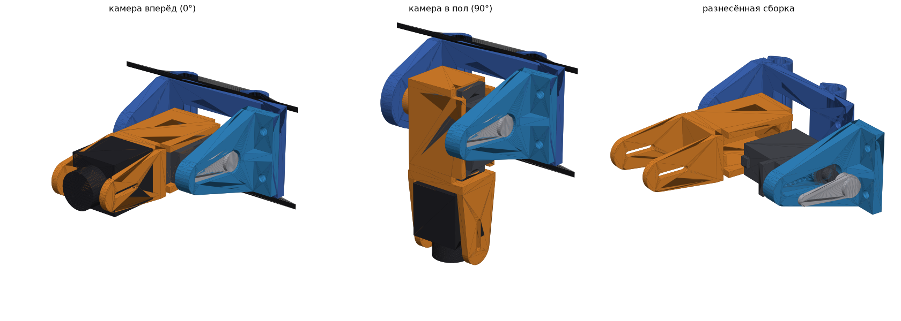

# Поворот камеры v2 для «Колибри» + MG90S (переделка после неудачной печати)

## Что было не так в первой версии и что исправлено

| Проблема | Причина | В v2 |
|---|---|---|
| MG90S не входит в люльку | гнездо впритык (+0.3 мм), втулке кабеля некуда, ушко серво упиралось в переднюю стенку | гнездо 23.6 × 13.0 (зазор 0.4 на сторону), фаски на входе, сквозной паз под втулку кабеля, полки под ушки на 16 мм от дна (ваш замер), ушки камеры вынесены за полку |
| Отломилось левое ухо | тонкое (4 мм), печаталось стоя (слои поперёк нагрузки), пазы под саморезы ослабили ухо | левое ухо — **отдельная деталь, печать плашмя** (слои вдоль уха), 6 мм, крепится к раме фланцем на 2 × M3 |
| Качалка «не держится» | качалка внутри, на саморезах в тонком диске | качалка **снаружи** в утопленном **кармане по форме качалки**: момент держит карман, шлиц проходит сквозь ухо, центральный винт откручивается снаружи |
| Винт оси не закрутить | M3 саморезом в тонкое дно, доступ мешал | M3×12 в **гайку M3 с нейлоном**, гайка в пазу бобышки люльки; винт и головка снаружи — свободный доступ |
| Камера не помещается | короткие ушки | ушки длиннее, **паз M2 на 10 мм**: камеры длиной 20…30 мм, ширина 19 мм |

Проверено `python3 tilt_v2.py --check`:
- серво входит и вставляется сверху без помех;
- камеры 20 и 28 мм встают в паз;
- качалка ложится в карман;
- ухо садится на раму;
- отвёрткой достаётся каждый винт;
- на ходе 0…90° касаний нет;
- позади стоек пусто.

## Детали

| Файл | Печать |
|---|---|
| `stl/tilt_v2/tilt_v2_frame_x1.stl` — рама: трубки на стойки + правое ухо | лёжа на правом ухе (так и лежит в STL), 4 периметра, 40 % |
| `stl/tilt_v2/tilt_v2_ear_left_horn_x1.stl` — левое ухо с карманом качалки | плашмя, фланец вверх, 100 % |
| `stl/tilt_v2/tilt_v2_cradle_x1.stl` — люлька серво с ушками камеры | как лежит, 4 периметра, 40 % |

Готовая печать на Ender-3 V3 SE, PETG: `print/Kolibri_cam_tilt_v2_Ender3V3SE_PETG.gcode` (≈2 ч 31 мин, 32 г). Проект: `print/Kolibri_cam_tilt_v2_Ender3V3SE_PETG.3mf`.

## Крепёж

- **MG90S:** одноплечая качалка из комплекта, центральный винт качалки, 2 самореза M2 из комплекта (ушки серво в полки), 2 коротких самореза ≤4 мм (качалка в карман).
- **Ось:** M3×12 + гайка M3 с нейлоном + шайба M3.
- **Левое ухо к раме:** 2 × M3×12 + 2 гайки M3.
- **Камера:** 2 × M2×5 (или её винты).

## Сборка

1. Гайку M3 с нейлоном вставить в паз бобышки люльки (снизу), до серво.
2. MG90S вставить в люльку **сверху**, втулка кабеля идёт в вертикальный паз передней стенки. Ушки серво — 2 самореза в полки.
3. Рама: 2 гайки M3 в гнёзда на задней стороне. Выкрутить винты 2 передних стоек, надеть трубки, закрутить обратно.
4. Люльку поставить к правому уху: M3×12 снаружи через ухо в нейлоновую гайку. Затянуть так, чтобы люлька качалась без люфта и без зажима.
5. Серво поставить в положение «камера вперёд». Качалку плечом вперёд вложить в карман левого уха и прикрутить 2 саморезами.
6. Ухо надеть на шлиц: ступица качалки садится на шлиц, фланец ложится на раму. Закрутить центральный винт качалки снаружи. Фланец прикрутить к раме 2 × M3×12 спереди.
7. Камеру поставить между ушками на M2 в пазы, выбрать вылет по длине камеры, подобрать наклон.
8. Конечные точки серво: 0° — вперёд, 90° — в пол. Проверить, что на краях серво не упирается и не гудит.
