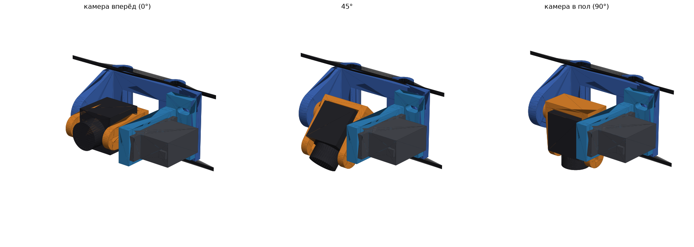

# Поворот камеры v3: «турель» MG90S на передних стойках «Колибри»

Схема как у турели MG90S 180° с MakerWorld (1308365). **Корпус серво неподвижен**, на качалке висит U-скоба с камерой. Второе ухо скобы вращается на оси M3 в правом ухе рамы. Всё крепится на две передние стойки (33 мм между центрами), за стойки ничего не выходит: плата ESP свободна.

## Проверено (`python3 turret_v3.py --check`)

| Проверка | Итог |
|---|---|
| MG90S в корпусе (зазор 0.4 мм на сторону, ушки на полках) | OK |
| Серво вставляется в корпус снаружи без помех | OK |
| Корпус на раме, рама не задевает плиты и стойки | OK |
| Качалка в кармане скобы (момент идёт через карман, не через саморезы) | OK |
| Камеры 20 и 28 мм (19 мм шириной) в пазу скобы | OK |
| Отвёртка достаёт до оси M3, 2 винтов фланца, 2 саморезов серво | OK |
| Ход 0…90° с камерами 20 и 28 мм: ничего не задевает | OK |
| Позади стоек пусто | OK |

Ось поворота: 23.5 мм впереди стоек, по высоте посередине между плитами. Ширина узла 66 мм.

## Печать: Ender-3 V3 SE, PETG

- `print/Kolibri_turret_v3_Ender3V3SE_PETG.gcode`: готовый G-code, все 3 детали за раз, **≈ 2 ч 08 мин, 24 г**.
- `3mf/Kolibri_turret_v3_MG90S.3mf`: тот же стол для слайсера.
- `stl/turret_v3/`: STL уже повёрнуты как печатать, поддержки не нужны.

| Деталь | Как лежит |
|---|---|
| `turret_v3_frame_x1` | стоя, трубки вертикально |
| `turret_v3_servo_housing_x1` | плитой шлица вниз, гнездо серво открыто вверх |
| `turret_v3_yoke_x1` | перемычкой вниз, уши вверх |

Слой 0.2, 4 периметра, gyroid 40 %, сопло 240 °C, стол 75 °C.

## Покупное

| Что | Шт | Куда |
|---|---|---|
| MG90S + одноплечая качалка + её саморезы | 1 | качалка в карман левого уха скобы |
| M3×12 + гайка M3 с нейлоном | 1 | ось: снаружи через правое ухо рамы в скобу, гайка в паз бобышки. **Не зажимать** |
| M3×10 + гайка M3 | 2 | фланец корпуса к раме, гайки в шестигранники сзади рамы |
| M2×5…6 | 2 | камера в паз скобы (с двух сторон) |

## Сборка

1. Раму надеть трубками на передние стойки, затем поставить штатные винты стоек.
2. Серво вставить в корпус снаружи, кабель в прорезь. Ушки закрепить 2 саморезами из комплекта серво.
3. Камеру закрепить в скобе винтами M2. Длинная камера сдвигается вперёд по пазу.
4. Подать на серво центр. Качалку уложить в карман скобы и закрепить её саморезами, центральный винт тоже вкрутить.
5. Скобу надеть качалкой на шлиц серво. Правое ухо скобы совместить с ухом рамы и вставить ось M3 с гайкой. Затягивать до отсутствия люфта, без зажима.
6. Корпус привинтить к раме 2 винтами M3. Пазы ±2 мм по ширине нужны, чтобы выставить скобу без перекоса. Скоба должна качаться рукой без заеданий.
7. Конечные точки серво выставить так, чтобы был ход 0…90°.

## Подключение (Betaflight 4.4+)

Нужна облачная сборка с `SERVOS`. Включить `feature SERVO_TILT`, `resource SERVO 1 <свободный пин>`, во вкладке Servos назначить AUX-канал. Питание серво 5 В от BEC.

Параметры (ось, ширина камеры, паз, толщины) — в начале `turret_v3.py`.
