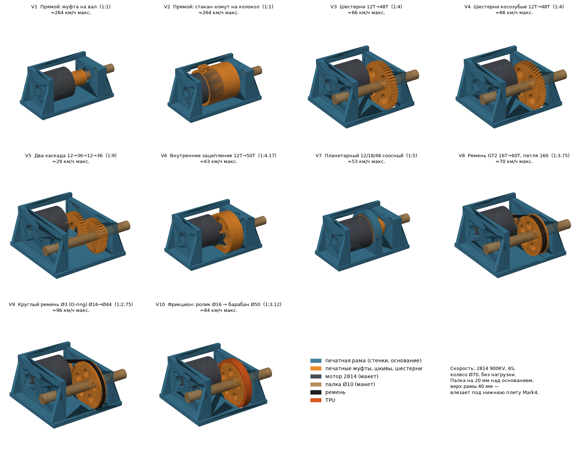

# Приводной модуль: 10 вариантов с мотором 2814 и палкой Ø10

Один мотор 2814 крутит палку Ø10 (общая задняя ось: оба колеса на её концах). Мотор стоит **рядом с палкой, параллельно ей и на той же высоте**. Всё собрано в коробчатой раме:

- **левая стенка**: мотор (винты снаружи) и первый подшипник палки;
- **правая стенка**: второй подшипник;
- **задняя стенка** с окном связывает стенки, чтобы коробка не складывалась при ударе;
- **передача** стоит между колоколом мотора и правой стенкой.

Палка на 20 мм над основанием, верх рамы 40 мм, так что модуль влезает под нижнюю плиту Mark4. В V1, V2, V6 и V7 палка выходит только вправо: мотор стоит соосно или венец закрывает левую сторону.

## Сравнение

Скорость указана без нагрузки: 2814 900KV, 6S, колесо Ø70. Пластик — всё печатное, 60 % плотности.

| # | Передача | Ратио | Км/ч | Пластик | Плюсы | Минусы |
|---|---|---|---|---|---|---|
| V1 | Муфта на вал (гайка M5 внутри) | 1:1 | 264 | 41 г | 2 детали, проще некуда | неуправляемо быстро, рывок на старте, гайка откручивается реверсом |
| V2 | Стакан-хомут на колокол | 1:1 | 264 | 61 г | момент с колокола, вал не гнётся | то же, что V1 |
| **V3** | **Шестерни 12T→48T, модуль 1** | **1:4** | **66** | **48 г** | надёжно, без натяжения, легко печатать | слышно, зубья боятся песка |
| V4 | То же, косозубые 20° | 1:4 | 66 | 48 г | тише и плавнее V3 | осевая сила на подшипники |
| V5 | Два каскада 12→36, 12→36 | 1:9 | 29 | 63 г | много момента, хорошо ползает | 3 шестерни, ещё 2 × 625ZZ и болт M5 |
| V6 | Внутреннее зацепление 12T→50T, модуль 0.8 | 1:4.17 | 63 | 51 г | зубья закрыты венцом от грязи | палка только с одной стороны, модуль 0.8 слабее |
| V7 | Планетарный 12/18/48, модуль 0.8 | 1:5 | 53 | 46 г | мотор соосно, самый узкий | 5 печатных шестерён, точная печать |
| **V8** | **Ремень GT2 16T→60T, петля 160** | **1:3.75** | **70** | **53 г** | тихо, гасит удары, ремень стоит копейки | нужно натяжение (пазы под мотор ±2.5 мм) |
| V9 | Круглый ремень Ø3 (O-ring) Ø16→Ø44 | 1:2.75 | 96 | 54 г | проскальзывает при ударе и бережёт мотор | быстро, слабое сцепление ремня |
| V10 | Фрикцион: ролик Ø16 → барабан Ø50 с TPU | 1:3.12 | 84 | 53 г | мягкий старт, без шума | шина изнашивается, буксует в воде и пыли |

**Рекомендация: V3** (или V4, если нужно тише), либо **V8**, если важны тишина и защита от ударов.

## Что проверено (`python3 drive_variants.py --check`)

- **Зацепление.** Ведущее колесо прокручивается на шаг зуба, ведомое — с передаточным числом. Пересечение зубьев 0 мм², при довороте на ¼ шага зубья упираются, значит они действительно в зацеплении.
  - V3–V7: все пары проверены. В V7 отдельно проверены солнце–сателлит и сателлит–венец.
- **Касания.** Шестерни, шкивы и муфты не касаются рамы и мотора. Под крупными колёсами передачи в основании есть прорези.

## Печать и покупное

| | |
|---|---|
| Рама `V*_frame` | PETG / PA-CF, как лежит, 4 периметра |
| Шестерни, шкивы | PA-CF / PA12 (PETG на пробу), 100 %, слой 0.12 мм; шестерни на вал мотора зажимаются гайкой пропеллера |
| Палка | Ø10 (сталь, алюминий или карбоновая трубка), 2 × 6800ZZ (10×19×5) в стенках |
| Мотор 2814 | 4 × M3×8 через левую стенку (4 отверстия по диагонали 19 мм, квадрат 13.4 × 13.4) |
| Ступицы на палке | поперечный винт M3 насквозь через палку (сверлить Ø3) или стопорный винт |
| V5 | болт M5×40 + 2 × 625ZZ для промежуточного блока |
| V7 | 3 × самореза M3×12 (оси сателлитов в водиле) |
| V8 | ремень GT2 6 мм, замкнутый 160 мм |
| V9 | кольцо Ø3, длина ≈ 160 мм (натяг 5–8 %) |

STL лежат в `stl/drive/V1…V10/`. В архиве `Kolibri_drive_10_variants_STL.zip` они же.

## Важно

- На общей палке оба задних колеса крутятся одинаково, дифференциала нет. В повороте внутреннее колесо проскальзывает, для небольшой машинки это нормально.
- Ограничьте ток регулятора до 15–20 А и газ до 25–30 %, особенно в V1, V2 и V9.
- Проверку на столе делать с поднятыми колёсами: шестерни и ремень затягивают пальцы и провода.

Параметры (высота палки, размеры мотора, KV, модуль шестерён) — в начале `drive_variants.py`.
