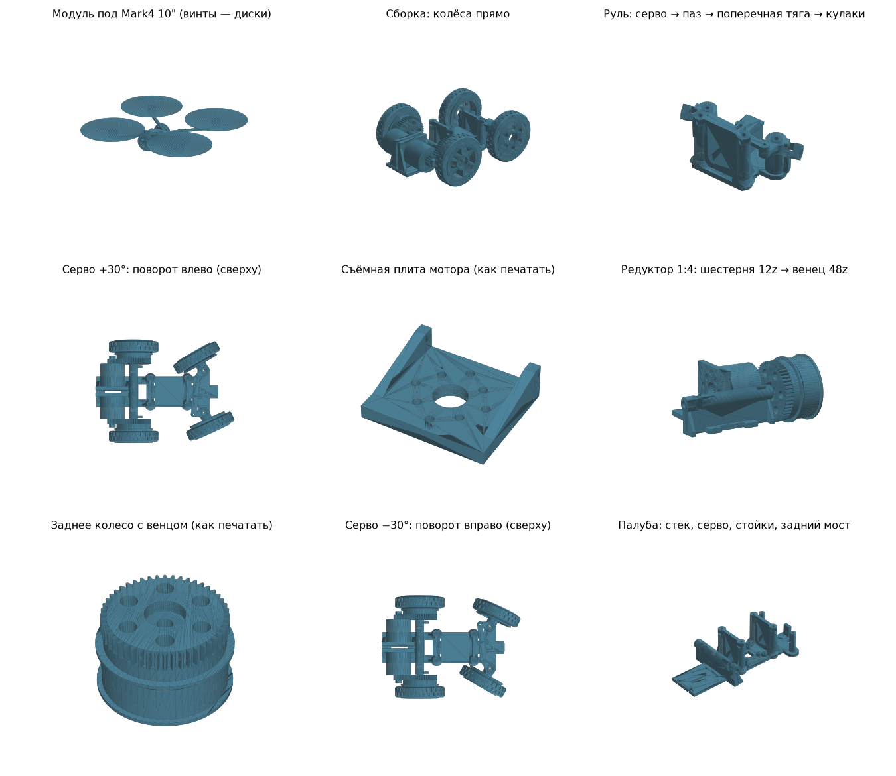

# Колёсный модуль «Колибри-кар» под Mark4 10"

Модуль ставится снизу на нижнюю плиту дрона 4 болтами M3 (отверстия 52.6 × 37). После этого дрон ездит как машинка на радиоуправлении, а летает и садится прямо на колёса. На модуле есть:

- место под **второй полётник**: стек 30.5×30.5 (M3) или 20×20 (M2);
- **передние поворотные колёса**. Серво MG90S поворачивает **оба колеса одновременно**: её палец (винт M2 на качалке) входит в паз поперечной тяги, тяга ведёт рычаги двух кулаков (трапеция Аккермана);
- **задние ведущие колёса** на двух моторах того же типа, что на дроне (2806–2807, крепление 16×16 или 19×19). Каждый мотор крутит своё колесо через **редуктор 1:4**: шестерня 12 зубьев на валу мотора и венец 48 зубьев на колесе.



## Компоновка

| Параметр | Значение |
|---|---|
| Колёсная база | 100 мм (оси X = ±50 от центра рамы) |
| Колея | перед 100 мм, зад 125 мм |
| Колесо | Ø70 × 20 мм, шина TPU |
| Редуктор | модуль 1, 12 → 48 зубьев, 1:4, межосевое 30.1 мм, перекрытие ε = 1.51 |
| Скорость (1300KV, 6S) | 26 м/с ≈ 95 км/ч без нагрузки; на 20 % газа ≈ 19 км/ч |
| Поворот колёс | серво ±30° → внутреннее колесо 30°, наружное 24.7° |
| Запас по касаниям | колёса свободно ходят до ±36°, тяга без касаний на всём ходу |
| Клиренс под палубой | 11 мм |
| Нижняя плита дрона над землёй | 57 мм |
| Модуль под дисками винтов | 14.3 см², это 0.7 % площади дисков 10" |
| Пластик | ≈ 250 г; с 2 моторами, серво, стеком и крепежом ≈ +400 г к дрону |

Модуль стоит в «коридоре» между дисками винтов (моторы дрона в ±151 мм, винт R 127). Поэтому он почти не перекрывает обдув.

## Детали (`stl/`)

| Файл | Шт | Материал | Как печатать |
|---|---|---|---|
| `car_deck_x1.stl` | 1 | PETG / PA-CF | как лежит, без поддержек; 4 периметра, 40 % |
| `car_motor_plate_L_x1.stl`, `car_motor_plate_R_x1.stl` | 1+1 | PETG / PA-CF | как лежит (внутренней стороной на стол); 100 % |
| `car_rear_wheel_gear48_x2.stl` | 2 | **PA-CF** или PETG | наружным торцом на стол, венец сверху; 100 %; диск над спицами печатается мостами |
| `car_pinion_12T_M5_x2.stl` | 2 | **PA-CF** / PA12 (PETG — только на пробу) | как лежит; 100 %, слой 0.12 мм |
| `car_rim_front_625_x2.stl` | 2 | PETG | наружным торцом на стол |
| `car_tire_TPU_x4.stl` | 4 | TPU 95A | как лежит |
| `car_knuckle_L_x1.stl`, `car_knuckle_R_x1.stl` | 1+1 | PETG / PA-CF | как лежит (вверх ногами, рычаг на столе); 100 % |
| `car_tie_bar_x1.stl` | 1 | PETG / PA-CF | как лежит (плоским верхом на стол); 100 % |
| `car_adapter_B_optional_x1.stl` | 1 | PETG | только если у рамы 52.6 идёт поперёк (см. ниже) |
| `preview_*.stl` | — | — | только для просмотра, не печатать |

Шестерню можно не печатать, а купить металлическую: модуль 1, 12 зубьев, отверстие 5 мм (пиньон для RC 1/8). Ширина — до 7 мм.

## Крепёж и покупное

| Узел | Что нужно |
|---|---|
| К раме | 4 × M3×12 сверху через нижнюю плиту, гайки M3 в боковые пазы стоек |
| Моторы к плитам | 2 × 4 × M3×8 с полукруглой (ISO 7380) или обычной головкой. Головка утоплена в цековку. Резьба в лапе мотора ≥ 5 мм, иначе M3×6 |
| Плиты к палубе | 4 × M3×10, гайки снизу палубы |
| Задние оси | 2 × M5×50, гайки M5 в пазы оси сверху, 4 × 625ZZ |
| Шестерни | садятся на вал M5 до колокола и зажимаются родной гайкой пропеллера |
| Передние оси | 2 × M5×25, 4 × 625ZZ, гайки M5 в паз кулака |
| Шкворни | 2 × M3×35–40 снизу через палубу, шайба M3×12 и самоконтрящаяся гайка сверху |
| Поперечная тяга | 2 × M2×10 + самоконтрящаяся гайка, без зажима |
| Серво | MG90S (металлические шестерни), 2 самореза M2 |
| Палец качалки | M2×12 снизу через отверстие качалки на 11–14 мм от вала, гайка M2 сверху; качалка с гайкой не выше 31 мм над палубой (тяга на 33 мм) |
| Стек | M3 (30.5) или M2 (20×20), гайки в гнёздах снизу палубы |
| Питание | от батареи дрона через разветвитель XT60 |

## Сборка заднего моста

1. **Моторы на плиты, на столе.** Мотор ставится лапой на наружную сторону плиты, винты вкручиваются изнутри. Головки должны утонуть в цековках: плиты потом встают спиной к спине с зазором 4 мм.
2. **Шестерня.** Надеть её на вал до упора в колокол и затянуть гайкой пропеллера. Если у колокола есть выступающий бортик вокруг вала, шестерня ляжет на него, это нормально.
3. **Плиты на палубу.** Ставятся позади заднего моста, 2 винта M3 через лапки на каждую плиту.
4. **Колёса.** Вставить гайку M5 в паз оси сверху, 2 подшипника в колесо (наружный и внутренний в венце). Надеть колесо на ось, чтобы венец вошёл в зацепление с шестернёй. Затянуть M5×50 снаружи.
5. **Проверка.** Колесо должно проворачиваться рукой вместе с мотором без заеданий и щелчков, с лёгким люфтом в зубьях.

> **Замерьте свой мотор.** Размер `MOTOR_LEN` (от лапы до верха колокола) по умолчанию 32 мм. От него зависит, где окажется шестерня относительно венца. Если ваш мотор отличается больше чем на 0.5 мм, впишите его размер в `generate_car.py` и пересоберите STL.

## Руль: сборка

1. Кулаки на шкворни, колёса пока не ставить. Кулаки должны поворачиваться от пальца, без заеданий.
2. Серво на опоры палубы, 2 самореза M2.
3. Подать на серво центр (1500 мкс) и только потом надеть качалку **назад**, вдоль оси машины.
4. В качалку поставить палец M2: винт снизу, гайка сверху.
5. Выставить колёса прямо. Надеть тягу бобышками на рычаги кулаков, чтобы палец вошёл в паз. Затянуть M2 с гайками без зажима.
6. В прошивке ограничить ход серво **±30°** (≈ 1170–1830 мкс для MG90S).

Проверенная кинематика (`python3 generate_car.py --check`):

| Качалка | Левое колесо | Правое колесо |
|---|---|---|
| −30° | −24.7° | −30.0° (внутреннее) |
| −20° | −17.1° | −19.2° |
| 0° | 0° | 0° |
| +20° | +19.2° | +17.1° |
| +30° | +30.0° (внутреннее) | +24.7° |

Оба колеса поворачивают в одну сторону, внутреннее в повороте сильнее. Угол «рычаг–тяга» на краю хода 38° и больше, до мёртвой точки далеко, тягу не перекинет.

## Прошивка второго полётника

Betaflight не умеет режим машинки. Используйте **INAV** (тип платформы Rover) или **ArduPilot Rover**:
- выход 1 — серво руля;
- выходы 2–3 — задние моторы.

Регулятор нужен **реверсивный** (AM32 или Bluejay в режиме 3D / bidirectional), иначе не будет заднего хода. Два задних мотора можно смешать как дифференциал: это помогает поворачивать.

Настройки, чтобы не сломать редуктор:
- ограничение газа 25–30 % (INAV `throttle_scale`, ArduPilot `MOT_THR_MAX`), это ≈ 25 км/ч;
- ограничение тока регулятора 15–20 А (в AM32 — Current Limit). Печатные зубья модуля 1 рассчитаны примерно на 10–20 А мотора. Больше — нужна металлическая шестерня;
- мягкий старт / ramp-up в регуляторе, без резкого газа с места.

## Под свою раму

Размеры задаются в начале `generate_car.py`:

- `MOTOR_LEN`: мотор от лапы до верха колокола (см. выше);
- `TOWER_H`: высота стоек до нижней плиты (сейчас 42, над колоколом 4.5 мм);
- `MOUNT_L`, `MOUNT_S`: болты нижней плиты;
- `PINION_Z`, `WHEEL_GEAR_Z`: число зубьев. Сумма должна остаться 60, иначе не хватит места под колокол;
- `REAR_X`, `FRONT_X`: колёсная база.

Если у вашей рамы отверстия 52.6 идут **поперёк** (слева направо), печатайте переходник `car_adapter_B`. Он ставится между стойками и плитой: 4 болта M3 с потайной головкой в стойки и 4 болта рамы с гайками снизу переходника. Высота вырастает на 5 мм.

```bash
pip install manifold3d numpy trimesh
python3 generate_car.py --check   # руль, редуктор, касания, клиренс, зона винтов
python3 generate_car.py           # пересобрать stl/
python3 render_preview.py         # обновить preview.png (нужен matplotlib)
```

## Ограничения

- Колея 100–125 мм, а дрон тяжёлый и высокий. Опрокидывание в повороте начнётся примерно с 0.6–0.7 g бокового ускорения. Ездить спокойно, без резких поворотов на скорости.
- Клиренс 11 мм: только ровные поверхности (асфальт, пол).
- Шестерни открытые. Песок и трава попадут в зубья, после такой езды их нужно чистить.

## Безопасность

- Проверку моторов на столе делайте с поднятыми колёсами. Шестерня затягивает пальцы и провода.
- Перед полётом проверьте гайки на шестернях и винты M5 задних осей.
- Для полёта модуль добавляет ≈ 400 г, это нужно учитывать в полётном времени и в настройке PID дрона.
