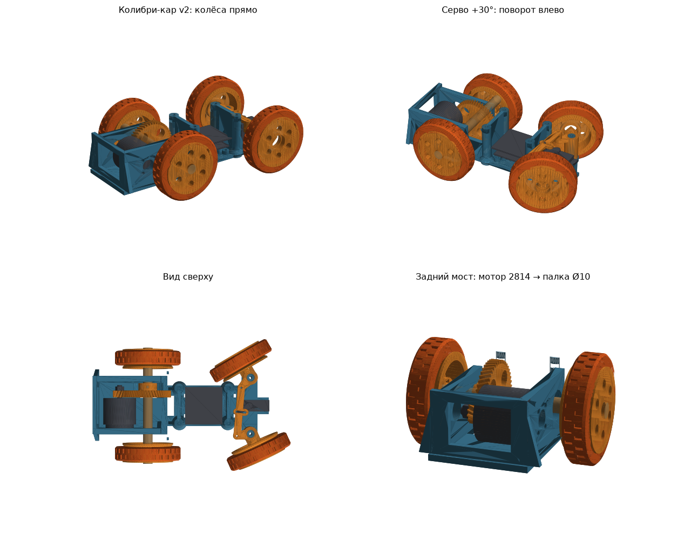

# «Колибри-кар v2»: печатная рама под дроном Mark4 10"

Рама крепится снизу к нижней плите дрона 4 болтами M3 (отверстия 52.6 × 37) и возит дрон как машинку.

- **Перед:** серво MG90S через поперечную тягу поворачивает **оба передних колеса** (трапеция Аккермана).
- **Зад:** один мотор **2814** через **косозубые шестерни 12→48 (1:4)** крутит **длинную сквозную палку Ø10**. Оба задних колеса надеты на её концы. Ремней нет.

## Почему V4 (вердикт трёх агентов)

| Эксперт | Его выбор | V3 | V4 | V5 | V10 |
|---|---|---|---|---|---|
| Прочность | **V4** | 6 | **7** | 5 | 4 |
| Печать и сборка | V3 (рама та же, что у V4) | 9 | 8 | 6 | 8 |
| Езда | V5 с ратио ~1:5 | 6 | 7 | 7 | 3 |

- **V4** не провалился ни у одного эксперта:
  - у косого зуба самый большой запас прочности: 2.5 при 20 А, 1.2 при 40 А (PA-CF), а удар делится на два зуба;
  - он тише прямозубого V3;
  - рама у V4 та же, что у V3.
- **V5** отклонён: вторая ступень срезается при упоре колеса (запас 0.66 при 20 А).
- **V1, V2, V6, V7** отклонены всеми тремя: у 2814 сплошной вал, палку сквозь мотор не провести.

## Параметры (проверено `python3 car_v2.py --check`)

| | |
|---|---|
| Габарит | 205 × 124 × 70 мм, база 110, колея 100 / 100 |
| Руль | серво ±30° → внутреннее колесо 30°, наружное 24.7°, свободно до ±36°, касаний нет |
| Передача | косозубая 12→48, модуль 1, межосевое 30.1; зубья не клинят на полном обороте и стоят в зацеплении |
| Скорость (2814 900KV, 6S) | ≈ 66 км/ч без нагрузки, на 30 % газа ≈ 20 км/ч |
| Клиренс | 10.3 мм (самая низкая точка — вершины зубьев 48T) |
| Высота | стойки упираются в нижнюю плиту (42 мм), мотор и стенки ниже |
| Под винтами дрона | 0.6 % площади дисков |
| Пластик | ≈ 240 г |

## Печать (`stl/v2/`)

| Файл | Шт | Материал | Как печатать |
|---|---|---|---|
| `v2_frame_x1.stl` | 1 | PETG / PA-CF | как лежит, 4 периметра, 40 %; гнёзда 6800 развернуть до Ø19 |
| `v2_V4_pinion_12T_x1.stl` | 1 | **PA-CF / PA12** | как лежит, 100 %, слой 0.12 |
| `v2_V4_gear_48T_x1.stl` | 1 | **PA-CF / PA12** | как лежит, 100 %, слой 0.12 |
| `v2_rear_wheel_rod10_x2.stl` | 2 | PETG / PA-CF | наружным торцом на стол |
| `v2_front_rim_625_x2.stl` | 2 | PETG | наружным торцом на стол |
| `v2_tire_TPU_x4.stl` | 4 | TPU 95A | как лежит |
| `v2_knuckle_L_x1.stl`, `v2_knuckle_R_x1.stl` | 1+1 | PETG / PA-CF | как лежит, 100 % |
| `v2_tie_bar_x1.stl` | 1 | PETG / PA-CF | как лежит, 100 % |
| `v2_adapter_B_optional_x1.stl` | 1 | PETG | только если у рамы 52.6 идёт поперёк |

Рама помещается на стол 220 × 220. Поддержки не нужны.

## Покупное

- **Палка:** стальная Ø10 × 124 мм (не карбон). Лыски 0.8–1 мм под стопорные винты: две на месте шестерни (под 90°) и по две на местах колёс.
- **Подшипники:** 2 × 6800ZZ (10×19×5) в стенки. 2 стопорных кольца DIN 471 Ø10 снаружи подшипников.
- **Стопоры на палке:** 6 × M3×6 (установочные) + 6 гаек M3. Гайки вставляются в пазы с торца ступиц.
- **Мотор:** 2814, 4 × M3×8 через левую стенку (4 отверстия по диагонали 19 мм, квадрат 13.4 × 13.4). Пазы ±0.5 мм — для регулировки зазора в зубьях.
- **Шестерня 12T:** на вал M5 до колокола, гайка пропеллера с фиксатором резьбы (средний).
- **Перед:** как в первой версии (`README.md`): 2 × M5×25, 4 × 625ZZ, шкворни M3×35–40, тяга M2, серво MG90S.
- **К раме дрона:** 4 × M3×12, гайки в боковые пазы стоек.

## Сборка заднего моста

1. Мотор на левую стенку изнутри, винты снаружи. Пока не затягивать.
2. Шестерню 12T на вал мотора, затянуть гайкой с фиксатором.
3. Палку вставить через правый подшипник, по пути надеть 48T, вывести через левый подшипник. Поставить стопорные кольца.
4. 48T совместить с 12T. Затянуть 2 стопора на лыски.
5. Сдвинуть мотор в пазах до лёгкого люфта зубьев (≈ 0.1 мм) и затянуть винты.
6. Колёса на концы палки, по 2 стопора на лыски.
7. Колёса прокрутить рукой: без заеданий и щелчков. Притереть шестерни 5 минут на малом газе без нагрузки.

Руль собирается так же, как в первой версии: серво в центр, качалку назад, палец (M2×12 снизу через качалку, гайка сверху) в паз тяги, ход ±30°.

### Серво: посадка и момент

- **Посадка.** MG90S / SG90 (корпус 23 × 12, ушки 32.5, винты через 27.8) стоит на палубе, ушки ложатся на две опоры высотой 15.5 мм. Если у вашей серво ушки выше, подложите шайбы M2 под ушки. Качалка с гайкой пальца должна быть не выше 31 мм над палубой: тяга на 33 мм.
- **Момент.** Передняя ось несёт ≈15.5 Н, плечо обката 20 мм. Повернуть колёса на месте на резиновом полу стоит ≈2.8 кг·см на валу серво. У MG90S 1.8–2.2 кг·см: на ходу хватит, на месте может не провернуть. Лучше поставить микро-серво того же размера с моментом от 3–3.5 кг·см на 6 В и металлическими шестернями, питание серво 6 В от BEC.

## Прошивка второго полётника (INAV Rover / ArduPilot Rover)

- Выход 1 — серво руля, выход 2 — мотор (регулятор AM32 в двунаправленном режиме, нужен для заднего хода).
- **Ток регулятора не больше 20 А**: ограничение по зубьям.
- **Газ ограничить до 30–35 %**: это ≈ 20–23 км/ч. На полном газу 66 км/ч, для узкой высокой машины это опрокидывание.
- Выключить тормоз регулятора (brake on stop). Садиться на колёса без сноса: раскрутка колёс при касании бьёт по зубьям.
- В ArduPilot поставить `ATC_TURN_MAX_G = 0.3`. В INAV уменьшать ход руля с ростом скорости.

## Ограничения

- Дифференциала нет: в повороте внутреннее колесо проскальзывает, машина хочет ехать прямо.
- Клиренс 10 мм, вершины 48T ближе всего к земле: только ровные поверхности.
- Зубья открыты снизу через прорезь: после пыли и песка их нужно чистить.

Параметры (вариант передачи, положение палки, высота) — в начале `car_v2.py`.
