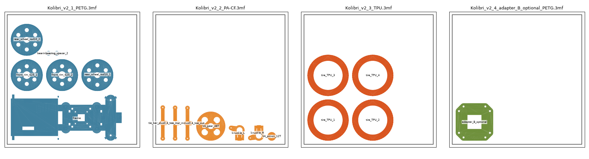
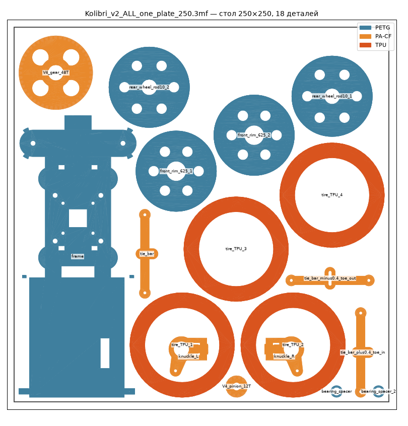

# «Колибри-кар v2»: печатная рама под дроном Mark4 10"

Рама крепится снизу к нижней плите «Колибри» 4 винтами M3 (отверстия 52.6 × 37) и возит дрон как машинку.

- **Перед:** серво поворачивает **оба передних колеса** через поперечную тягу (трапеция Аккермана). Есть механический упор на 33°.
- **Зад:** один мотор **2814** (крепление 4 × M3 по диагонали 19 мм) через **косозубые шестерни 12→48 (1:4)** крутит **сквозную палку Ø10**. Задние колёса стоят на концах палки. Ремней нет.

## Проверено (`python3 car_v2.py --check`)

Модель проверена кодом и тремя независимыми проверками (кинематика, крепёж, печать и прочность). Найденные проблемы исправлены.

| | |
|---|---|
| Габарит | 205 × 124 × 73 мм, база 110, колея 100 / 100 |
| Дрон | нижняя плита 58 мм над палубой (73 над землёй). Лучи выше шин на **6 мм** на всём ходу руля |
| Руль | качалка ±36° → внутреннее колесо 29°, наружное 24.5°. Касаний нет, мёртвой точки нет (угол рычаг–тяга ≥ 41°) |
| Упор поворота | 33°. Шина касается стойки на ~36°, упор её до этого не пускает |
| Передача | косозубая 12→48, модуль 1. Зубья не клинят на полном обороте и стоят в зацеплении |
| Скорость (2814 900KV, 6S) | ≈ 66 км/ч без нагрузки, на 30 % газа ≈ 20 км/ч |
| Клиренс | 9 мм (палуба 6 мм) |
| Пластик | ≈ 250 г |

## 3MF для слайсера (`3mf/`)

Готовые столы 220 × 220, по одному файлу на материал. Детали уже лежат как печатать, количество копий учтено. Открываются в Bambu Studio, OrcaSlicer, PrusaSlicer и Cura.

| Файл | Что внутри |
|---|---|
| `Kolibri_v2_1_PETG.3mf` | рама, 2 передних обода, 2 задних колеса, 2 проставки подшипников |
| `Kolibri_v2_2_PA-CF.3mf` | шестерни 12T и 48T, кулаки Л/П, тяга и 2 запасные тяги для схождения |
| `Kolibri_v2_3_TPU.3mf` | 4 шины |
| `Kolibri_v2_4_adapter_B_optional_PETG.3mf` | переходник, только если у рамы 52.6 идёт поперёк |

### Всё на одном столе

`Kolibri_v2_ALL_one_plate_250.3mf`: все 18 деталей на одном столе **250 × 250**. Мелочь (кулаки) лежит внутри шин. Подходит для Bambu Lab X1, P1 и A1 (256 × 256) и других столов от 250 мм. На 220 × 220 всё сразу не помещается, там печатайте по отдельным файлам.

Каждая деталь подписана материалом: `PETG_…`, `PA-CF_…`, `TPU_…`. В слайсере назначьте филамент по имени.
- **Многоцветный принтер (AMS и подобные):** весь стол печатается за раз. TPU через AMS обычно не подаётся, шины удобнее напечатать отдельно (`Kolibri_v2_3_TPU.3mf`).
- **Один материал:** удалите со стола шины и печатайте остальное из PA-CF или PETG. Для шестерён и кулаков PETG слабее.

Пересобрать: `python3 car_v2.py && python3 export_3mf.py`.

## Печать (`stl/v2/`)

| Файл | Шт | Материал | Как печатать |
|---|---|---|---|
| `v2_frame_x1` | 1 | PETG / PA-CF | как лежит, 4 периметра, 40 %. Гнёзда 6800 развернуть до Ø19 |
| `v2_V4_pinion_12T_x1`, `v2_V4_gear_48T_x1` | 1+1 | **PA-CF / PA12** | как лежит, 100 %, слой 0.12 |
| `v2_knuckle_L_x1`, `v2_knuckle_R_x1` | 1+1 | **PA-CF** (или PETG) | как лежит (вверх ногами), 100 % |
| `v2_tie_bar_x1` | 1 | **PA-CF** (или PETG) | плоским верхом на стол, 100 % |
| `toe/v2_tie_bar_minus0.4…`, `toe/v2_tie_bar_plus0.4…` | по 1 | как тяга | запасные длины для схождения: ±0.8° на колесо |
| `v2_front_rim_625_x2` | 2 | PETG | наружным торцом на стол |
| `v2_bearing_spacer_x2` | 2 | PETG / PA-CF | проставка 2 мм между подшипниками переднего колеса |
| `v2_rear_wheel_rod10_x2` | 2 | PETG / PA-CF | наружным торцом на стол |
| `v2_tire_TPU_x4` | 4 | TPU 95A | как лежит |
| `v2_adapter_B_optional_x1` | 1 | PETG | только если у рамы 52.6 идёт поперёк |

Поддержки не нужны. Рама 190 × 78 мм, помещается на стол 220 × 220.

**После печати:**
- отверстия M2 в рычагах и тяге рассверлить сверлом 2.0;
- паз тяги довести надфилем до свободного хода пальца;
- гильзы кулаков развернуть по стойкам шкворней Ø10, шов на стойках зашкурить;
- отверстие M5 в кулаке прогнать сверлом 5.0–5.2;
- на гнёздах подшипников со стороны стола снять фаску («слоновья нога»).

## Покупное

### Передний мост (на обе стороны)

| Что | Шт | Куда |
|---|---|---|
| M3×40 DIN 912 + шайба M3×12 (широкая) + гайка M3 с нейлоном | 2 | шкворни: снизу через палубу, головка в цековке 3 мм |
| 625ZZ (5×16×5) | 4 | по 2 в передний обод, между ними печатная проставка |
| M5×25 + шайба 5×10×1 + гайка M5 | 2 | ось колеса: гайка вставляется в паз кулака сверху, винт снаружи через подшипники |
| M2×20 + гайка M2 с нейлоном | 2 | тяга на рычаги кулаков: головка под рычаг, гайка сверху тяги. Не зажимать |
| M2×16, сталь 12.9 (не нержавейка) + гайка M2 | 1 | палец качалки: винт снизу через качалку на 10–13 мм от вала, гайка сверху качалки |
| Серво 23 × 12 мм (MG90S или мощнее, см. ниже) + 2 самореза M2×8 из комплекта | 1 | на опоры, кабель проходит в прорези опоры |

### Задний мост

- **Палка:** стальная Ø10 × 124 мм. Лыски 0.8–1 мм под стопорные винты: 2 под шестерню (под 90°) и по 2 под каждое колесо.
- **Подшипники палки:** 2 × 6800ZZ (10×19×5) и 2 стопорных кольца DIN 471 Ø10 снаружи подшипников.
- **Стопоры на палке:** 6 × M3×6 (установочные) и 6 гаек M3. Гайки вставляются в пазы с торца ступиц.
- **Мотор 2814:** 4 × M3×8 через левую стенку (4 отверстия по диагонали 19 мм, пазы ±0.5 мм).
- **Шестерня 12T:** на вал до колокола, гайка пропеллера на фиксатор резьбы средней силы.

### Крепление к дрону

- 4 × M3×12 сверху через нижнюю плиту, гайки в боковые пазы стоек.
- Хомуты 3 мм под прорези в палубе для проводов.

## Сборка переднего моста

1. **Колёса (на столе).** В обод запрессовать подшипник, вставить проставку, запрессовать второй подшипник. Шина на обод.
2. **Кулаки на шкворни.** Кулак надеть на стойку Ø10. Сверху широкая шайба и гайка M3 с нейлоном. Винт M3×40 вставляется снизу. Затянуть до лёгкого вращения кулака без осевого люфта.
3. **Колёса на кулаки.** Гайку M5 вставить в паз кулака сверху. Колесо с подшипниками надеть на ромб оси. Снаружи M5×25 с шайбой. Затянуть: колесо крутится свободно, подшипники не зажаты (зажата только проставка).
4. **Серво (до тяги).** Тяга закрывает задний саморез серво, поэтому серво ставится первой. Серво на опоры, кабель в прорезь, 2 самореза M2.
5. **Качалка.** Подать на серво центр (1500 мкс), надеть качалку назад вдоль машины. Палец M2×16 вставить снизу в отверстие качалки на 10–13 мм от вала, гайка сверху.
6. **Тяга.** Колёса прямо. Тягу опустить сверху так, чтобы палец вошёл в паз, а бобышки легли на рычаги. Винты M2×20 вставить снизу, гайки с нейлоном сверху. Не зажимать.
7. **Конечные точки серво: ±36°** (≈ 1100–1900 мкс). Кулаки не должны доходить до упоров: упор — защита, а не рабочий ход.
8. **Схождение.** Поставить колёса прямо, сравнить расстояние между шинами спереди и сзади. Если разница больше 1 мм, поставить тягу ±0.4 из папки `toe/`.

## Серво: момент

Передняя ось несёт ≈ 15.5 Н, плечо обката 20 мм, качалка 11 мм.
- **На ходу** колёса поворачиваются легко, MG90S хватает.
- **На месте на резине** в худшем случае нужно ≈ 2.4 кг·см (оценка проверяющего: реально 0.7–1.2 кг·см плюс трение). У MG90S 1.8–2.2 кг·см.
- **Совет:** микро-серво того же размера с моментом от 3 кг·см на 6 В. Питание 6 В от BEC. В прошивке не крутить руль до упора на месте.

## Сборка заднего моста

1. Мотор на левую стенку изнутри, винты снаружи, пока не затягивать.
2. Шестерню 12T на вал мотора, гайка с фиксатором.
3. Палку провести через правый подшипник, надеть 48T, вывести через левый подшипник. Поставить стопорные кольца.
4. 48T совместить с 12T, затянуть 2 стопора на лыски.
5. Сдвинуть мотор в пазах до лёгкого люфта зубьев (≈ 0.1 мм) и затянуть винты.
6. Колёса на концы палки, по 2 стопора на лыски.
7. Прокрутить рукой: без заеданий и щелчков. Притереть шестерни 5 минут на малом газе.

## Прошивка (INAV Rover / ArduPilot Rover)

- Выход 1 — серво руля (±36°), выход 2 — мотор (регулятор AM32, двунаправленный режим).
- Ток регулятора не больше **20 А**, газ не больше **30–35 %** (≈ 20 км/ч).
- Тормоз регулятора выключить. Садиться на колёса без сноса.
- ArduPilot: `ATC_TURN_MAX_G = 0.3`. INAV: уменьшать ход руля с ростом скорости.

## Ограничения

- Дрон стоит выше (плита в 73 мм над землёй), чтобы лучи прошли над колёсами. Центр масс выше, опрокидывание в повороте начнётся примерно с 0.5 g. Ездить спокойно.
- Дифференциала нет: в повороте внутреннее заднее колесо проскальзывает.
- Клиренс 9 мм: только ровные поверхности. Зубья открыты снизу, после пыли их нужно чистить.
- Кастера нет (шкворень вертикальный): руль сам в центр не возвращается, держит серво.

Параметры (передача, высота стоек, ход серво) — в начале `car_v2.py` и `generate_car.py`.
