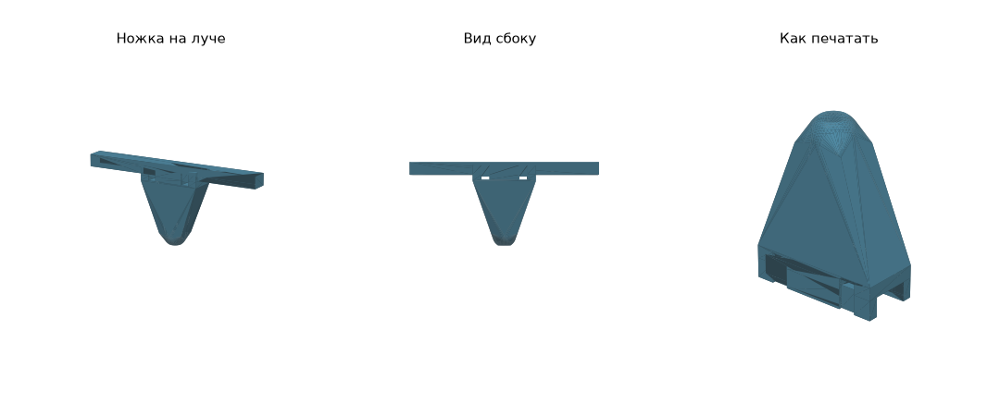

# Простые неподвижные ножки (без серво)

Одна деталь из TPU на каждый луч. Без шарниров, нитей и серво.

## Печать

| Файл | Шт | Материал | Настройки |
|---|---|---|---|
| `stl/fixed/kolibri_fixed_leg_TPU_x4.stl` | 4 | **TPU 95A** | седлом на стол (как лежит), 3 периметра, gyroid 20–25 %, без поддержек |

Около 9–10 г TPU на ножку (при 20 % заполнения), всего около 40 г.

Заполнение — это амортизатор: 15 % мягче, 35 % жёстче. Из PETG печатать не стоит: жёсткая ножка при посадке со сносом ломается (см. `sim/`).

## Размеры

- Под луч 11.22 × 8 мм, зазор 0.4 мм.
- Седло 40 мм вдоль луча, щёки 6 мм.
- Ножка 45 мм под лучом (≈42 мм под нижней плитой), пятка с плоской площадкой.

Высота меняется параметром `LEG_H` в `fixed_legs.py`. После изменения запустите `python3 fixed_legs.py`.

## Установка

1. Ставить на ~120 мм от центра рамы. Там был замер луча. Если луч к мотору сужается, седло будет болтаться.
2. Два хомута **4.8 мм** на ножку. Хомут 3.6 мм тоже влезет, но он слабее, см. расчёт ниже. Хомут идёт поверх луча, по канавкам на щеках и через туннель под лучом.
3. Замок хомута поставить сверху луча, затянуть плоскогубцами, хвост срезать.

## Оценка посадки (2.5 кг, та же модель, что в `sim/`)

| Касание | Сила на ножку | Сжатие ножки | Запас карбонового луча | Хомут при сносе 1 м/с |
|---|---|---|---|---|
| 1 м/с, бетон | ~145 Н | ~2.4 мм | 5.5 | ~156 Н |
| 1.5 м/с, бетон | ~215 Н | ~3.6 мм | 3.7 | ~156 Н |
| 2 м/с, бетон | ~286 Н | ~4.8 мм | 2.8 | ~156 Н |
| 1 м/с, трава | ~75 Н | ~1.3 мм | 10.6 | ~57 Н |

- **TPU не трескается.** При перегрузке ножка сминается и возвращается в форму.
- **Слабое место — хомуты.** Хомут 3.6 мм держит около 180 Н, это на грани. Хомут 4.8 мм держит 220–400 Н.
- **Жёсткость ножки** (~60 Н/мм) — оценка для 20 % gyroid. Реальная зависит от TPU и настроек печати.
