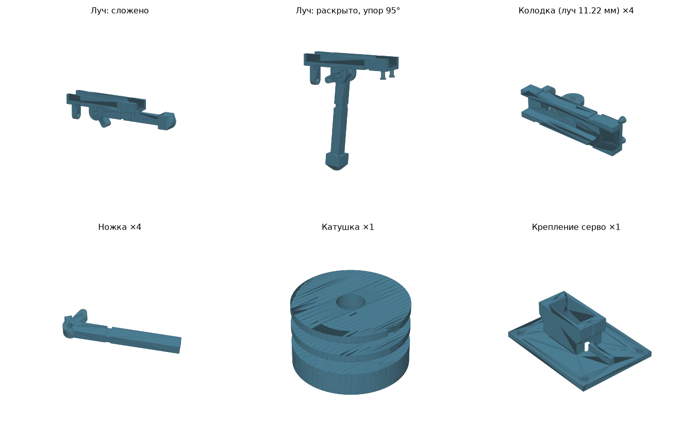

# Убирающиеся ножки для «Колибри» (рама Mark4 V3 10")

> Нужны простые ножки без серво? См. [FIXED_LEGS.md](FIXED_LEGS.md).

Четыре ножки на серединах лучей. Резинка держит их сложенными под лучом. Одна серво в центре наматывает нити на катушку и откидывает все ножки до упора 95°.

Подогнано под Mark4 10": колёсная база 427 мм (центр–мотор 213.5 мм), луч 11.22 × 8 мм, стек 30.5×30.5.



## Посадка на луч

Колодка сделана под замеренный луч **11.22 × 8 мм** (зазор 0.4 мм заложен). Щёки высотой 6 мм плотно обнимают луч, а снизу колодка шире луча (18 мм), чтобы штыри резинки не задевали ножку. Ставится в **120 мм от центра рамы**.

## Детали (`stl/`)

| Файл | Шт | Материал | Как печатать |
|---|---|---|---|
| `kolibri_block_x4.stl` | 4 | PETG / PA-CF | на боку, как лежит; 100 % заполнение в зоне ушей |
| `kolibri_leg_x4.stl` | 4 | PETG / PA-CF | плашмя, как лежит; 4 периметра |
| `kolibri_foot_TPU_x4.stl` | 4 | TPU 95A | карманом вниз |
| `kolibri_spool_x1.stl` | 1 | PETG | как лежит |
| `kolibri_servo_mount_x1.stl` | 1 | PETG | пластиной на стол |
| `preview_arm_*.stl` | — | — | только для просмотра, не печатать |

## Крепёж и расходники

- Ось шарнира: 4 × винт M3×20 с самоконтрящейся гайкой.
- Колодка на луч: 2 хомута 3.6 мм на колодку. Сверлить луч 11 мм под M3 не рекомендуется, это ослабит его.
- Серво MG90S (металлические шестерни; SG90 для 10" слабовато), 2 самореза M2 в крепление. Качалка-крестовина крепится к катушке 2–4 саморезами 2 мм: в основании катушки есть направляющие отверстия на радиусах 6 и 10 мм. Если с дырками качалки они не совпали, саморез вкручивается прямо в сплошное основание 5 мм.
- Крепление серво: 4 болта M3 в отверстия рамы 52.6 × 37 мм снизу нижней плиты. Вал серво (катушка) получается точно в центре между болтами. Вал ставится со стороны выемки-метки на ухе. Гнездо глубиной 20 мм подходит и под SG90, и под MG90S.
- Нить: кевлар или плетёнка 0.4 мм, 4 отрезка по ~20 см.
- Резинка: кольцо Ø15–20 мм (O-ring 1.5 мм или канцелярская резинка), 4 шт.

## Сборка

1. Вставить ножку между ушами колодки, продеть ось M3. Ножка должна качаться свободно, без люфта.
2. Надеть пятку из TPU на конец ножки (на каплю клея).
3. Резинку накинуть на штырь, провести под ножкой через проточку и накинуть на второй штырь. Ножка должна сама прижиматься к лучу.
4. Колодку надеть на луч снизу так, чтобы ось шарнира была в **120 мм от центра рамы**: ось ближе к центру, штыри ближе к мотору. Затянуть хомутами. Сложенная ножка с пяткой заканчивается на ~193 мм от центра и не достаёт до винтов мотора.
5. Нить привязать к отверстию в рычажке, провести через ушко колодки к центру.
6. Катушка: у неё 2 яруса с одним сквозным отверстием на каждом. Переверните дрон брюхом вверх, метка на верхнем фланце катушки при сложенных ножках смотрит между двумя лучами.
   - **Нижний ярус** (ближе к серво): пара лучей по одной диагонали. Первый луч в 45° против часовой стрелки от метки, второй напротив.
   - **Верхний ярус**: другая диагональ, 135° и 315° от метки.
   - Нити одной пары заходят в отверстие своего яруса с двух сторон. Их выводят в центральный канал и завязывают там узлом.
   - Каждая нить обматывает барабан примерно на четверть оборота, **против часовой стрелки, если смотреть на брюхо**. Нить лежит в своей половине паза.
7. Сначала закрутить винт качалки серво, потом вязать узлы: после этого узлы закрывают доступ отвёрткой. Серво в 0°, ножки сложены. Натянуть нити без слабины и затянуть узлы.
8. Выставить конечную точку серво так, чтобы все 4 ножки дошли до упора (≈107° поворота катушки). Серво не должно упираться: лишний ход греет его и тянет ток.

## Расчётные величины

| Параметр | Значение |
|---|---|
| Ход ножки | 0° → 95° (упор зубом ступицы в колодку) |
| Ход нити | 14.8 мм |
| Поворот катушки Ø16 | ≈106°, против часовой стрелки со стороны брюха |
| Длина ножки с пяткой от оси | ≈73 мм, сечение 8 × 7 мм |
| Кончик пятки ниже луча | ≈80 мм |
| Серво с катушкой ниже нижней плиты | ≈48 мм, запас клиренса ≈29 мм |
| Ось шарнира | M3 |

## Под свою раму

Все размеры задаются в начале `generate.py`: ширина луча `ARM_W` (11.22), доп. ширины `ARM_W_VARIANTS`, длина ножки `LEG_LEN`, болты крепления серво `MOUNT_HOLES`, радиус катушки `SPOOL_R` и т.д.

```bash
pip install manifold3d numpy trimesh
python3 generate.py --check   # проверка столкновений по всему ходу и расчёт нити
python3 generate.py           # пересобрать stl/
python3 render_preview.py     # обновить preview.png (нужен matplotlib)
```

После изменения `PIVOT_DEPTH`, `TOOTH_R` или `TOOTH_ANGLE` запустите `--check`: строка «первое касание при раскрытии» должна показывать 95°.

## Безопасность

- Если серво обесточится, резинки сложат ножки и дрон сядет на брюхо.
- Моторы на столе проверять только без пропеллеров.
- Ход серво и его конечные точки проверять до установки нитей, чтобы серво не порвало их и не сломало рычажки.
