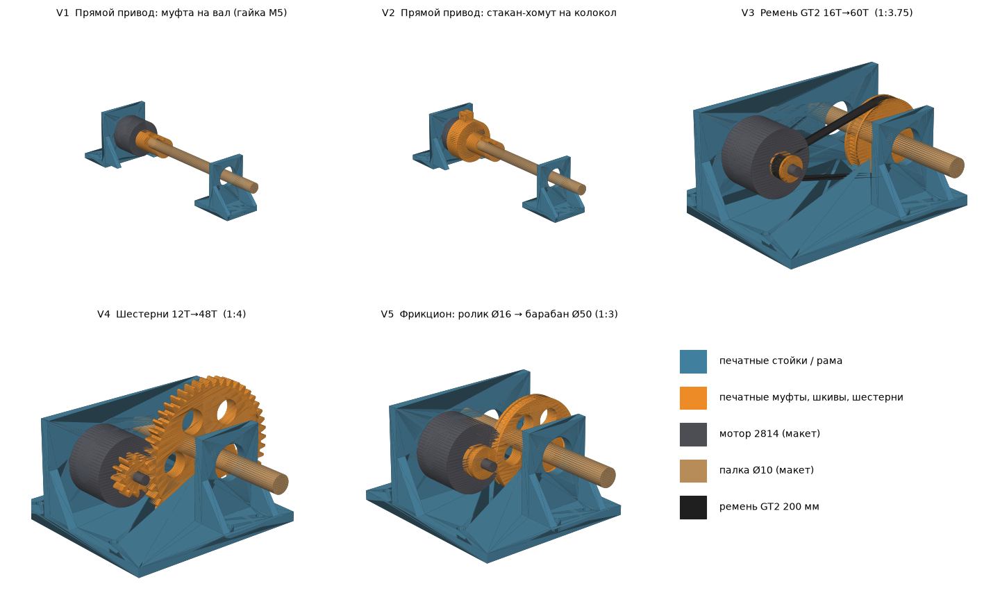

# Мотор 2814 крутит палку — 5 печатных вариантов

Палка по умолчанию Ø10 мм, подшипники 6800 (10×19×5). Крепёж мотора M3 (16×19).
Все размеры меняются в начале `generate.py` (`STICK_D`, `BELL_D`, `MOTOR_H`, `H` и др.),
затем `python3 generate.py` пересобирает `stl/` и `preview.png`.

| Вариант | Детали (stl/) | Передача | Покупное |
|---|---|---|---|
| V1 муфта на вал | `V1_V2_motor_stand`, `V1_coupler_shaft`, `V1_V2_bearing_stand_x2` | 1:1 | гайка M5, 3× винт M3×8 + гайки, 6800 |
| V2 стакан на колокол | `V1_V2_motor_stand`, `V2_coupler_bell`, `V1_V2_bearing_stand_x2` | 1:1 | винт M3×20 + гайка (хомут), 2× M3×8, 6800 |
| V3 ремень GT2 | `V3_frame_gt2`, `V3_pulley_16T_motor`, `V3_pulley_60T_stick` | 1:3.75 | ремень GT2 замкнутый 200 мм ×6 мм, гайка M5, 2× 6800 |
| V4 шестерни | `V4_frame_gears`, `V4_gear_12T_motor`, `V4_gear_48T_stick` | 1:4 | гайка M5, 2× 6800 |
| V5 фрикцион | `V5_frame_friction`, `V5_roller_motor`, `V5_drum_stick` | ~1:3 | резиновое кольцо 2 мм на ролик, резинка на барабан, 2× 6800 |

## Как собрать
- **Колесо на мотор (V3–V5)** садится на вал и прижимается к колоколу гайкой M5,
  как пропеллер. Если вал без резьбы — берите V2 (стакан на колокол).
- **Колесо на палку** держится радиальным винтом M3; гайка M3 вставляется в паз сверху.
- **Натяжение (V3, V5)**: отверстия мотора — прорези ±3 мм, сдвиньте мотор от палки и затяните.
- **V1/V2**: стойку подшипника лучше ставить две, если палка длинная.

## Печать
- Стойки/рамы: PETG, 4 периметра, 40% заполнения, основанием на стол.
- Колёса и муфты: PETG/нейлон, 100% или 5+ периметров, торцом на стол.
- Сначала напечатайте маленький шкив и проверьте, как ремень садится на зубья.

## Безопасность
- Только через ESC (регулятор), ограничьте ток. При заклинивании 2814 сгорит.
- Закройте шестерни и ремень кожухом: они затягивают пальцы и провода.
